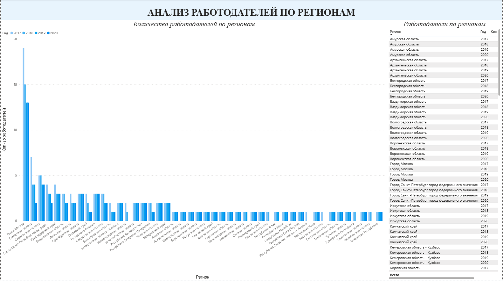
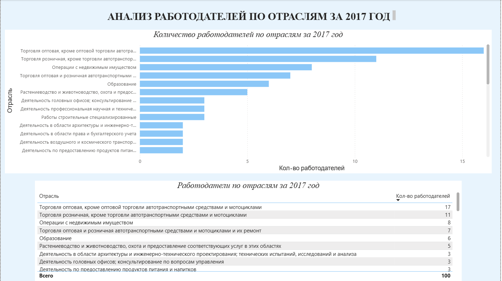
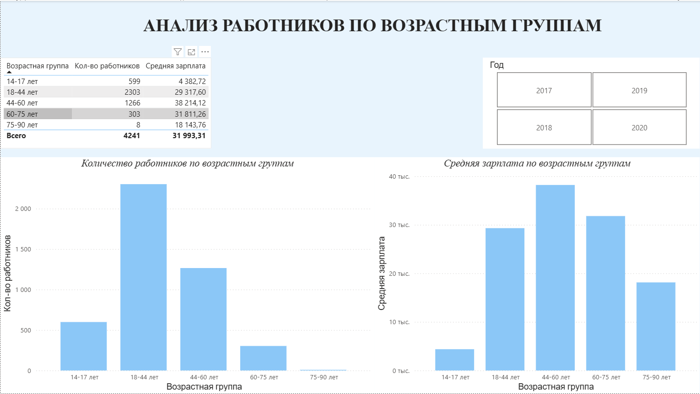

# Проект 4: Анализ рынка труда в Power BI

Дашборд по работодателям и работникам — кто где работает, сколько платят и как меняется по годам и регионам.

## Что внутри:

1. Работодатели по регионам — динамика 2017–2020, с фильтром по году
2. Работодатели по отраслям за 2017 — топ оптовая и розничная торговля
3. Работники по возрастным группам — считала среднюю зарплату по возрастам, 44-60 лет получают больше всех

## Инструменты

Power BI Desktop, DAX, CSV

## Превью

