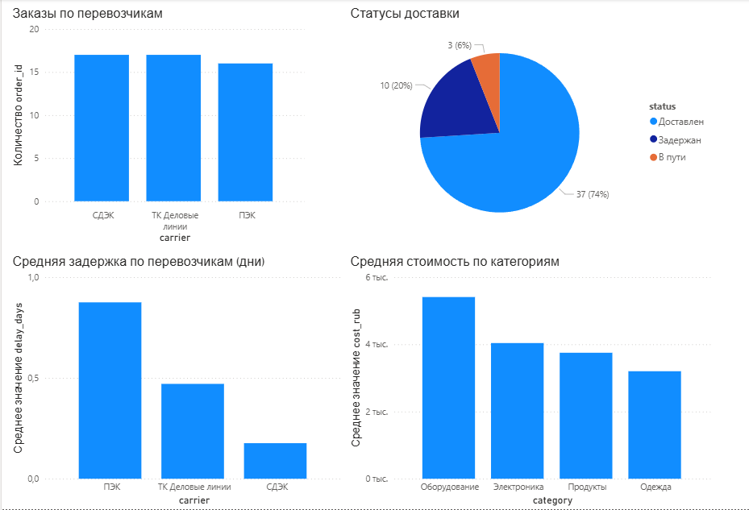

# Проект 1: Логистический дашборд в Power BI

Дашборд для анализа перевозок — смотрим кто везёт, сколько задерживает и во что это обходится.

## Что внутри:

1. Заказы по перевозчикам — СДЭК, ПЭК, ТК Деловые Линии
2. Статусы доставки — сколько доставлено вовремя, сколько задержано
3. Задержки по перевозчикам — считала через DAX, интересно получилось
4. Стоимость по категориям груза — оборудование оказалось самым дорогим

## Инструменты

Power BI Desktop, DAX, CSV

## Превью

