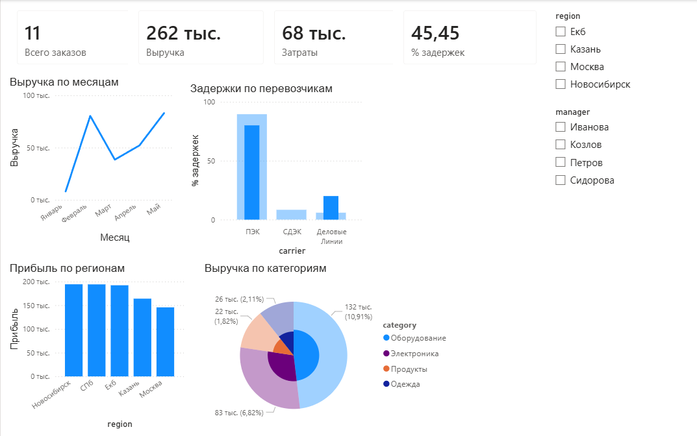

# Проект 3: Операционный BI-отчёт в Power BI

Финальный проект — полноценный операционный отчёт для логистической компании.
Анализируем выручку, прибыль, задержки по регионам и менеджерам.

## Что внутри

1. KPI-карточки: заказы, выручка, затраты, процент задержек
2. Динамика выручки по месяцам
3. Прибыль по регионам
4. Задержки по перевозчикам
5. Выручка по категориям товаров
6. Два среза: по региону и менеджеру

## Новое по сравнению с Проектом 2

1. KPI-карточки для ключевых метрик
2. Линейный график динамики
3. Меры с зависимостями: Прибыль = Выручка - Затраты
4. Два среза одновременно

## Инструменты

Power BI Desktop, DAX, Power Query, CSV

## Превью

